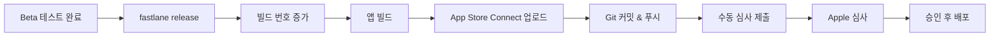

# SecureOTP 배포 가이드

fastlane을 사용한 자동화된 앱 배포 가이드입니다.

## 📋 목차

- [사전 준비](#사전-준비)
- [초기 설정](#초기-설정)
- [배포 명령어](#배포-명령어)
- [트러블슈팅](#트러블슈팅)

## 🔧 사전 준비

### 1. fastlane 설치 확인

```bash
fastlane --version
```

설치되지 않은 경우:
```bash
# Homebrew
brew install fastlane

# 또는 RubyGems
sudo gem install fastlane
```

### 2. Apple Developer 계정

- [Apple Developer Program](https://developer.apple.com/programs/) 가입 필요
- Team ID 확인 (Account → Membership)
- App Store Connect 접근 권한

### 3. 앱 등록

App Store Connect에서 앱 등록:
1. https://appstoreconnect.apple.com 접속
2. "My Apps" → "+" → "New App"
3. Bundle ID: `com.quettasoft.app.SecureOTP`
4. 앱 정보 입력

## ⚙️ 초기 설정

### 1. 환경 변수 설정

> ⚠️ **비공개 레포지토리**: 이 프로젝트는 비공개이므로 `.env` 파일이 git에 포함되어 있습니다.

`.env` 파일 직접 편집:
```bash
# Apple Developer Account
APPLE_ID=your.email@example.com

# Team IDs
TEAM_ID=ABC123XYZ              # Developer Portal Team ID
ITC_TEAM_ID=123456789          # App Store Connect Team ID

# (선택) App Store Connect API Key
APP_STORE_CONNECT_API_KEY_ID=XXXXXXXXXX
APP_STORE_CONNECT_API_ISSUER_ID=XXXXXXXX-XXXX-XXXX-XXXX-XXXXXXXXXXXX
APP_STORE_CONNECT_API_KEY_FILEPATH=./AuthKey_XXXXXXXXXX.p8
```

**Team ID 찾는 방법:**
1. [Apple Developer](https://developer.apple.com/account) → Membership
2. Team ID 복사

**App Store Connect Team ID:**
1. App Store Connect → Users and Access → Keys
2. Issuer ID가 ITC_TEAM_ID

### 2. App Store Connect API Key 생성 (권장)

API Key를 사용하면 2FA 없이 자동 배포 가능:

1. [App Store Connect](https://appstoreconnect.apple.com/access/api) 접속
2. Users and Access → Keys → "+" 클릭
3. Key 이름 입력, Access: "App Manager" 또는 "Admin"
4. `AuthKey_XXXXXXXXXX.p8` 파일 다운로드
5. 프로젝트 루트에 저장
6. `.env` 파일에 경로 설정

### 3. Code Signing 설정 (match)

**옵션 A: 수동 설정**
- Xcode에서 Signing & Capabilities 설정
- Automatic Signing 활성화

**옵션 B: match 사용 (팀 작업 시 권장)**

```bash
# match 저장소 생성 (private GitHub repo)
fastlane match init

# 인증서 생성
fastlane setup_signing
```

## 🚀 배포 명령어

### 버전 정보 확인

```bash
fastlane version_info
```

출력 예시:
```
Current Version: 1.0.0 (123)
```

### 빌드

#### 개발용 빌드
```bash
fastlane build
```

#### 테스트 실행
```bash
fastlane test
```

### TestFlight 배포 (베타)

```bash
fastlane beta
```

**자동으로 실행되는 작업:**
1. ✅ Git 상태 확인 (clean working directory)
2. 📈 빌드 번호 자동 증가
3. 🔨 앱 빌드 (App Store 프로비저닝)
4. ☁️ TestFlight 업로드
5. 📝 버전 커밋 및 태그 생성
6. 🔄 Git push

**출력 예시:**
```
Successfully uploaded beta build to TestFlight! 🚀
Version: 1.0.0 (124)
```

### App Store 배포 (프로덕션)

```bash
fastlane release
```

**자동으로 실행되는 작업:**
1. ✅ Git 상태 확인
2. ✅ main 브랜치 확인
3. 📈 빌드 번호 자동 증가
4. 🔨 앱 빌드 (App Store 프로비저닝)
5. ☁️ App Store Connect 업로드
6. 📝 버전 커밋 및 태그 생성
7. 🔄 Git push

**참고:**
- `submit_for_review: false`로 설정되어 있어 자동 제출 안됨
- App Store Connect에서 수동으로 심사 제출 필요

### 버전 관리

#### 버전 번호 증가

```bash
# Patch: 1.0.0 → 1.0.1
fastlane bump_version type:patch

# Minor: 1.0.0 → 1.1.0
fastlane bump_version type:minor

# Major: 1.0.0 → 2.0.0
fastlane bump_version type:major
```

#### 특정 버전 설정

```bash
fastlane set_version version:2.0.0
```

### 스크린샷

```bash
# 모든 기기/언어 스크린샷 생성 및 업로드
fastlane screenshots
```

### 정리

```bash
# 빌드 아티팩트 삭제
fastlane clean
```

## 🔐 보안

### 민감 정보 관리

> ⚠️ **중요**: 이 레포지토리는 **비공개(Private)**입니다.
>
> **레포지토리를 공개(Public)로 변경하면 안 됩니다!**
> - `.env` 파일에 Apple ID, Team ID 등이 포함되어 있습니다
> - 공개 시 즉시 보안 위험이 발생합니다

**비공개 레포지토리에서 git에 포함된 파일:**
- ⚠️ `.env` (환경 변수 - 비공개 레포만 가능)
- ✅ `.env.default` (템플릿)
- ✅ `fastlane/Fastfile`
- ✅ `fastlane/Appfile`

**절대로 git에 커밋하면 안 되는 파일 (비공개 레포에서도):**
- ❌ `*.p8` (App Store Connect API Key 파일)
- ❌ `fastlane/README.md` (자동 생성, 계정 정보 포함 가능)

**공개 레포지토리로 전환 시 필수 작업:**
1. `.env` 파일 삭제
2. Git history에서 `.env` 제거:
   ```bash
   git filter-branch --force --index-filter \
     "git rm --cached --ignore-unmatch .env" \
     --prune-empty --tag-name-filter cat -- --all
   ```
3. `.gitignore`에 `.env` 추가
4. 모든 credentials 재발급 (노출된 것으로 간주)

## 📱 CI/CD 통합

### GitHub Actions

`.github/workflows/deploy.yml` 생성:

```yaml
name: Deploy to TestFlight

on:
  push:
    branches: [ main ]

jobs:
  deploy:
    runs-on: macos-latest

    steps:
    - uses: actions/checkout@v3

    - name: Set up Ruby
      uses: ruby/setup-ruby@v1
      with:
        ruby-version: 3.0
        bundler-cache: true

    - name: Install fastlane
      run: bundle install

    - name: Deploy to TestFlight
      env:
        APPLE_ID: ${{ secrets.APPLE_ID }}
        TEAM_ID: ${{ secrets.TEAM_ID }}
        ITC_TEAM_ID: ${{ secrets.ITC_TEAM_ID }}
        MATCH_PASSWORD: ${{ secrets.MATCH_PASSWORD }}
        MATCH_GIT_URL: ${{ secrets.MATCH_GIT_URL }}
      run: fastlane beta
```

**GitHub Secrets 설정:**
1. Repository → Settings → Secrets and variables → Actions
2. New repository secret 클릭
3. `.env` 파일의 모든 변수 추가

## 🐛 트러블슈팅

### 1. "Provisioning profile doesn't match"

**해결:**
```bash
# 프로비저닝 프로파일 다시 생성
fastlane setup_signing
```

### 2. "Authentication failed"

**원인:** Apple ID 또는 2FA 문제

**해결:**
1. App Store Connect API Key 사용 (권장)
2. 또는 Application-specific password 생성:
   - https://appleid.apple.com → Security
   - App-Specific Passwords → Generate

### 3. "Build number already exists"

**해결:**
```bash
# 빌드 번호 수동 증가
increment_build_number
```

또는 App Store Connect에서 최신 빌드 번호 확인 후 수동 설정

### 4. Git not clean

**해결:**
```bash
# 변경사항 커밋
git add .
git commit -m "Update"

# 또는 체크 건너뛰기 (권장하지 않음)
SKIP_GIT_CHECK=true fastlane beta
```

### 5. "No code signing identity found"

**해결:**
1. Xcode → Preferences → Accounts
2. Apple ID 추가
3. Download Manual Profiles 클릭

## 📊 배포 프로세스

### Beta (TestFlight) 배포


### Production (App Store) 배포



## 📞 지원

문제가 발생하면:
1. [fastlane 공식 문서](https://docs.fastlane.tools/)
2. [fastlane GitHub Issues](https://github.com/fastlane/fastlane/issues)
3. 팀 Slack 채널

## 📝 체크리스트

### 첫 배포 전

- [ ] Apple Developer Program 가입
- [ ] App Store Connect에 앱 등록
- [ ] `.env` 파일 설정
- [ ] Team ID 확인
- [ ] Code Signing 설정
- [ ] `fastlane version_info` 실행 확인

### 매 배포 시

- [ ] 변경사항 테스트 완료
- [ ] Git 커밋 완료
- [ ] 버전/빌드 번호 확인
- [ ] 배포 명령어 실행
- [ ] TestFlight/App Store Connect에서 확인

---

**만든 날짜:** 2025-12-23
**업데이트:** 2025-12-23
**담당자:** Quetta Soft Development Team
